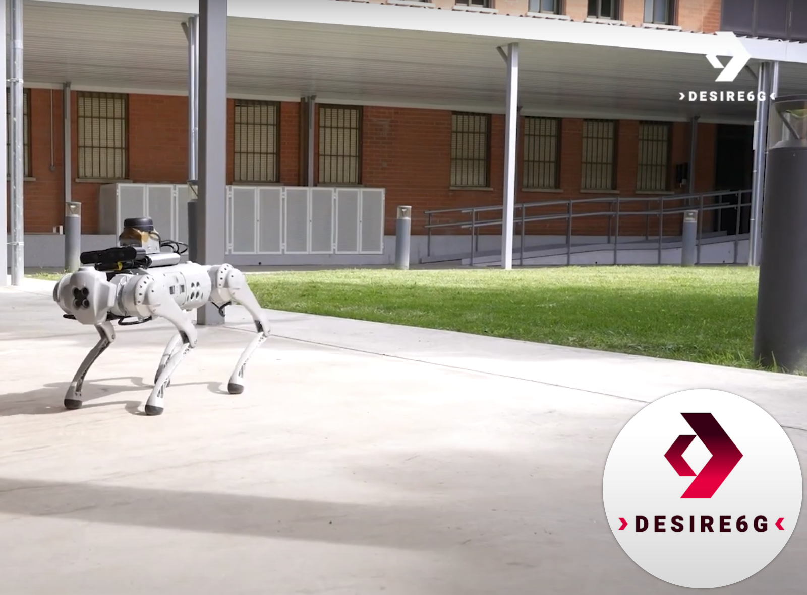

# Digital Twin Application — DESIRE6G Project

  
    
  
  
  
  

---

This repository contains the implementation of the **Digital Twin** use case developed as part of the [DESIRE6G](https://desire6g.eu/) project.

The use case involves the [Unitree Go1](https://unitree-docs.readthedocs.io/en/latest/get_started/Go1_Edu.html) quadruped robot and the [NVIDIA Isaac Sim](https://developer.nvidia.com/isaac-sim) simulator.

🎥 **Watch the Year-2 project demo video:**  
[https://youtu.be/E5fGB1bzGsE](https://youtu.be/E5fGB1bzGsE?si=zCtv7Jmg6u1TIVQ2)

**Author:** Adam Zahir Rodriguez  
**Version:** 1.0

---

## Table of Contents

- [Requirements](#requirements)
- [Digital Twin Modules](#digital-twin-modules)
- [Running the Digital Twin Service](#running-the-digital-twin-service)
- [License](#license)
- [Acknowledgments](#acknowledgments)

---

## Requirements

- Ubuntu (tested on 18.04 LTS)
- [Docker Engine](https://docs.docker.com/engine/install/ubuntu/) (tested on version 23.0.1)
- [Docker Compose](https://docs.docker.com/compose/install/) (tested on version 2.16.0)
- NVIDIA GPU (RTX 2070 or higher)
- [NVIDIA GPU Driver](https://www.nvidia.com/en-us/drivers/unix/) (version 525.85 or higher recommended)
- [NVIDIA Container Toolkit](https://github.com/NVIDIA/nvidia-container-toolkit) (tested on version 1.14.3)
- [NVIDIA Omniverse Streaming Client](https://docs.isaacsim.omniverse.nvidia.com/latest/installation/manual_livestream_clients.html)
- Kubernetes: (tested on K3s distribution — version 1.28.8+k3s1)

---

## Digital Twin Modules

The [Digital Twin service](./digital-twin-service/) is composed of the following main components:

| Module                 | Description                                                                                                     | Status       |
|------------------------|-----------------------------------------------------------------------------------------------------------------|--------------|
| **ROS Master**         | Provides naming and registration services to ROS nodes ([details](./digital-twin-service/ros-master/))         | ✅ Available |
| **Go1 Base**           | Interfaces with the robot using the unitree_legged_sdk via ROS ([details](./digital-twin-service/go1-base/))       | ✅ Available |
| **Gesture Control App**| Translates camera-based gestures into robot velocity commands ([details](./digital-twin-service/gesture-control-app/)) | ✅ Available |
| **Digital Replica**    | Simulates the Unitree Go1 in NVIDIA Isaac Sim ([details](./digital-twin-service/digital-replica/))              | ✅ Available |
| **Lidar Drivers**      | Drivers for the RPLIDAR A3 used in mapping and navigation ([details](./digital-twin-service/lidar-drivers/))    | ✅ Available |
| **Camera Drivers**     | Drivers for the Orbbec Astra S depth camera ([details](./digital-twin-service/camera-drivers/))                 | ✅ Available |
| **Go1 Navigation**     | SLAM-based algorithms for indoor mapping ([details](./digital-twin-service/go1-navigation/))                          | ✅ Available |
| **Vizanti**            | Provides web visualizer for mapping and sensor streams ([details](./digital-twin-service/vizanti/))                  | ✅ Available |

---
 
## Running the Digital Twin Service

The scenarios [folder](./scenarios/) contains various deployment options:
- Docker scenarios (tutorial [here](./scenarios/docker/)) ✅ Available   
- Kubernetes scenarios (tutorial [here](./scenarios/kubernetes/)) ✅ Available   

---

## License
This repository is distributed under a specific license. See the [LICENSE](./LICENSE.txt) file for more details.

⚠️ This software may not be copied, modified, sold, or distributed beyond the terms expressed in the license agreement.

This software may not be copied, modified, sold or distributed other than
expressed in the named license agreement.

---

## Acknowledgments
This project utilizes software provided by **Mybotshop GmbH**.  
Visit [Mybotshop](https://www.docs.mybotshop.de/) for more information

Use of this software is governed by the **Mybotshop Software Usage Agreement**, which prohibits forwarding, sharing, or distributing the software without explicit consent.