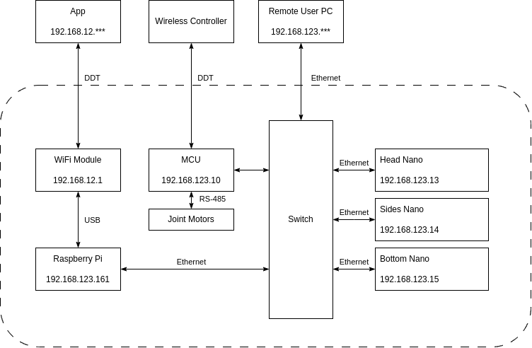

# Unitree Go1 ROS Base. 

## What is it?

This repository contains the files (hardware drivers) that communicate with motors of the Unitree Go1 robot using ROS.

The Unitree Go1 work in two modes:

- **High-level mode**: Allows for whole-body control like commanding velocities and orientations to the robot.
- **Low-level mode**: Allows for control over individual joints where the user can command position, velocities, and torques to each motor in each leg.

> Note: in this demo we will focus on the high level mode, since we are going to control the whole-body to perform SLAM and navigation tasks.

Here is a diagram that represents visually the internal architecture of the robot:



The Go1 incorporates several onboard computers, all interconnected via a LAN with the address range of `192.168.123.0/24`. The most relevant components for this project are: 

- **Raspberry Pi (192.168.123.161)**: Allows high-level control.
- **MCU (192.168.123.10)**: Allows low-level control of each joint.

To connect an additional device, simply plug it into the Ethernet port and assign an IP address from the specified range (e.g., 192.168.123.162).

For further information, refer to the documentation available at: [Unitree Go1 Quick Start](https://www.docs.quadruped.de/projects/go1/html/quick_start.html)

## What does this container do?

This container runs the [bringup.launch](catkin_ws/src/qre_go1/go1_bringup/launch/bringup.launch) file, serving as a ROS wrapper facilitating communication with the internal computer boards of the robot (either high-level or low-level) via ROS topics.

## Run it?

### Dependencies:

The Unitree Go1 ROS Base depends on:
  - ros-master (tutorial [here](../ros-master/))

### First you will need to build the container. 

In order to do that, run the following script:
```bash
./build.sh
```

### This will build the `go1-base` docker image. 

Verify that the image is present by running:
```bash
docker image ls
```

### Docker run example
In this folder we also provide a docker run example. 

> Note: be sure you have access to the robot's internal network `192.168.123.0/24`

To run the Unitree Go1 ROS Base in high-level mode:
```bash
./run_example.sh --target-ip 192.168.123.161 --udp-send-dt 0.01 --udp-recve-dt 0.01 --state-loop-rate 100
```

This command initiates the `bringup.launch` with the `TARGET_IP` parameter set to `192.168.123.161`, representing the IP address of the target internal computer board for high-level control.

> Note: this container serves as a ROS wrapper; internal communication between the robot boards occurs via UDP using the [unitree_legged_sdk](https://github.com/unitreerobotics/unitree_legged_sdk). The Raspberry Pi (high-level board) communicates over UDP port 8082, while the MCU (low-level board) communicates over UDP port 8007.

Verify that the container is up and running:
```bash
docker ps
```

In the output you should be able to see the `go1-base` container up and running.