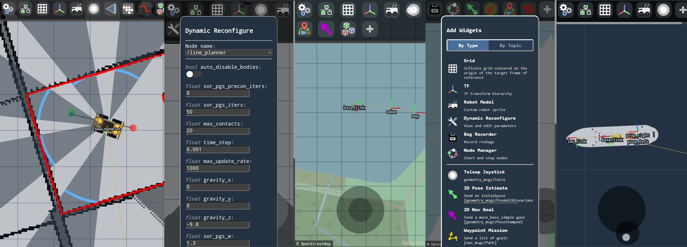

#  Vizanti - Web Visualizer & Mission Planner for ROS

> This project is a fork of [https://github.com/MoffKalast/vizanti](https://github.com/MoffKalast/vizanti).

[](https://opensource.org/licenses/BSD-3-Clause) [](https://build.ros.org/job/Ndev__vizanti__ubuntu_focal_amd64/4/)

Vizanti is a web-based visualization and control tool developed for more convenient operation of outdoor robots running the Robot Operating System (ROS). The application attempts to replicate RViz's orthographic 2D view as closely as possible with a smartphone friendly interface. The second goal is to allow planning and executing movement and mission commands, i.e. goals and waypoints, with custom buttons and parameter reconfigure.

 

## Run it?

### Dependencies:

- ros-master (tutorial [here](../ros-master/))

### First you will need to build the container. 

In order to do that, run the following script:
```bash
./build.sh
```

### This will build the `vizanti` docker image. 

Verify that the image is present by running:
```bash
docker image ls
```

### Docker run example
In this folder we also provide a docker run example. 

To run the ROS vizanti:
```bash
./run_example.sh
```

Verify that the container is up and running:
```bash
docker ps
```

In the output you should be able to see the `vizanti` container up and running.

### How to use it?

The web app can be accessed at `http://<host_ip>:5000`